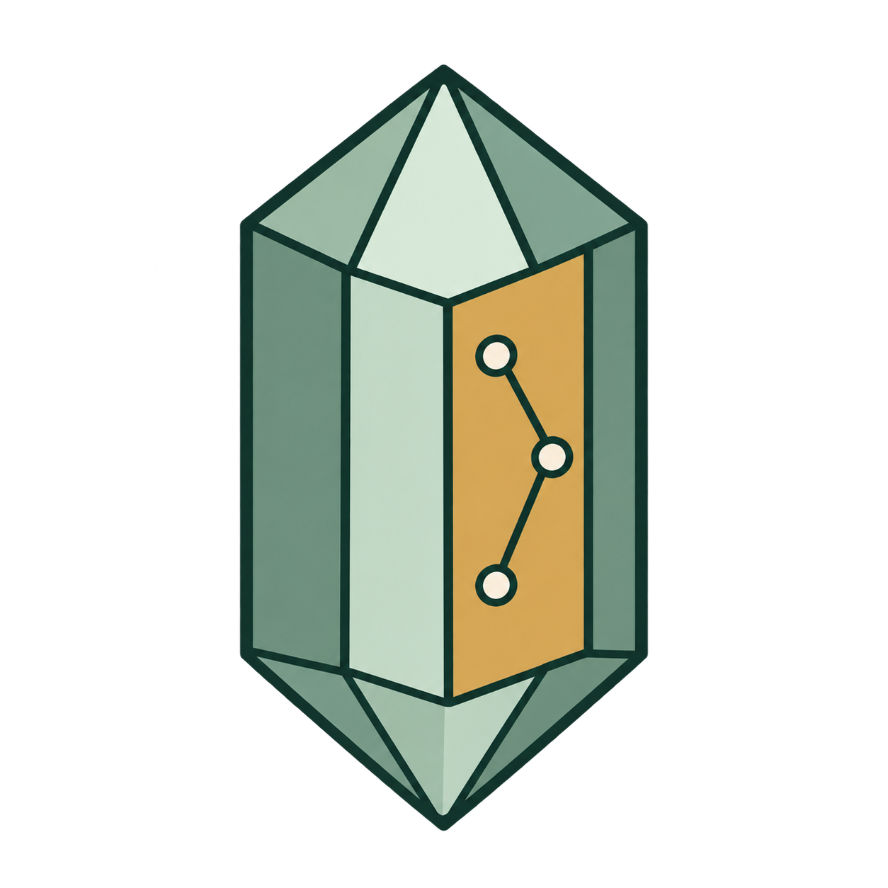
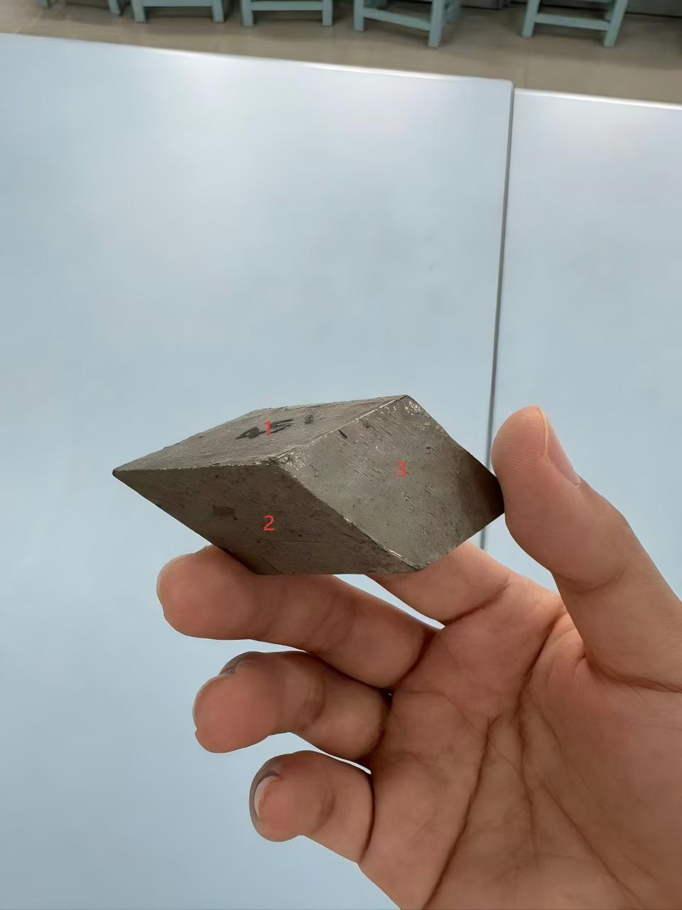
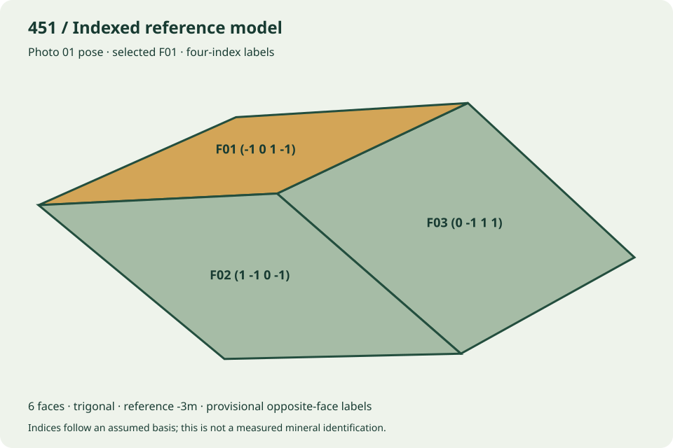

<a id="english"></a>

# Mineral Atlas Workbench

[](#english)
[](#中文)

[](https://www.python.org/)
[](#three-ways-to-work)
[](#crystal-faces-and-coordinate-systems)
[](https://github.com/QiushanHuang/mineral-atlas-workbench/releases/latest)
[](https://github.com/QiushanHuang/mineral-atlas-workbench/actions/workflows/ci.yml)
[](LICENSE)

<p align="center"></p>

**Mineral Atlas Workbench** is a local-first crystal-face workbench for teaching models, Miller indices, photograph comparison, and reproducible reports.

It is built for the moment when a report lists a face such as `(1 0 −1 0)`, but you still need to know **which face it is, how it meets its neighbors, and how that assignment relates to the photograph**.

The same computational core powers a browser interface, a command-line tool, and an agent plugin. Parameters and evidence stay with the result, so another person can reproduce the calculation instead of reconstructing the workflow from a conversation.

## Why Mineral Atlas

- Locate a specific face by its index or face ID, rather than guessing from a drawing
- Keep three-axis and four-axis conventions explicit
- Compare candidate geometry with photographs without hiding uncertain labels
- Generate the five crystallographic report fields from the same data as the model
- Run the core workflow offline, without an account, API key, or runtime downloads
- Share a project file, an offline result, or the complete software and skill package

## Three Ways To Work

| Entry point | Best for | Requirements |
|---|---|---|
| Prebuilt atlas | Inspect the 15 reference models and 226 faces | A browser; no Python or server |
| Local workbench / CLI | Build new models, mark photographs, export reports | Python 3.10+; optional fitting dependencies |
| Agent plugin / skill | Reuse the evidence, modeling, and validation workflow in Codex or another compatible host | A compatible host and local Python |

The core does not send photographs to a remote service. The optional vision adapter only contacts a user-installed Ollama service on `127.0.0.1`; it does not download models.

## Real Photo Example: Model 451

This is one photo set explicitly authorized for public release by QiushanHuang: **three source photographs, two annotated camera fits, and a six-face trigonal reference model**.

| Source photograph | Computed reference model in the same pose |
|---|---|
|  |  |

The photographs are unchanged; the right panel is drawn from the saved model and fitted camera. It demonstrates how a face number becomes a selectable, indexed surface. The interactive example additionally provides rotation, real shared-edge topology, photograph switching, fitted wireframe overlays, and the five-field report.

**[Browse the complete example data](examples/451-photo-study/)** · **[Download the offline photo example](https://github.com/QiushanHuang/mineral-atlas-workbench/releases/download/v1.0.0/mineral-atlas-451-photo-example.zip)**

```bash
# Replay saved camera fits; standard-library Python is sufficient.
python3 scripts/build_photo_example.py --out atlas-runs/451-photo-study
```

Open the exported `index.html`, select **照片视角** and **线框叠加**, then switch photographs or enter `F01`. To refit with NumPy/SciPy, add `--refit`; this explicitly refreshes the example's saved fit files. [Full reproduction instructions](examples/451-photo-study/README.md).

The two fits have approximately **8.77px** and **11.99px** corner RMSE at960×1280. These are fitting errors, not independent accuracy measurements. Photo03 is supplementary observation only; the reference basis and provisional opposite-face labels remain documented. [Photo provenance and publication scope](examples/451-photo-study/DATA_NOTICE.md).

## Features

- Interactive crystal rotation, stable zoom, face selection, crystal axes, and opposite-face lookup
- Three-index `(h k l)` and four-index `(h k i l)` parsing, including negative and overbar notation
- Reference symmetry operations for the 32 crystallographic point-group classes
- Half-space construction from a direct basis, face indices, and support distances
- Real shared-edge adjacency, linked to the spatial model and face table
- Checks for incompatible bases, duplicate directions, missing closure, inactive faces, face-count conflicts, and invalid topology
- Plane, convexity, winding, positive-volume, Euler, index-normal, and declared-symmetry checks
- Original-pixel photograph annotations, silhouettes, and optional face-center constraints
- Optional deterministic coarse-to-fine camera fitting, robust losses, alternative correspondences, and independent holdout errors
- Five-field reports: **symmetry class, crystal system, axis selection, geometric constants, and crystal-face symbols**
- Content-addressed outputs with checksums, preserved inputs, and verified cache reuse
- Seven local MCP tools and a self-contained `mineral-face-atlas` skill

## v1.0.0 Release Highlights

This is the first public release of the shared offline workflow.

- Migrated 15 reference teaching models into portable project files.
- Unified three-axis and four-axis indexing without changing the fixed-scale rotation behavior.
- Added a browser workflow for parameters, geometry checks, photograph annotations, and exports.
- Replaced broad random camera initialization with deterministic coarse-to-fine fitting.
- Added standalone software, plugin, and skill distributions with no private source photographs.
- Added a synthetic camera fixture so the full annotation and fitting workflow can be checked without supplying a photograph.
- Added English and Chinese documentation, a project logo, contributor attribution, and CI.

## Installation

Product name: **Mineral Atlas Workbench**. Plugin name: `mineral-atlas-workbench`. Skill name: `mineral-face-atlas`.

### Download A Release

Download from [GitHub Releases](https://github.com/QiushanHuang/mineral-atlas-workbench/releases/latest):

- **`mineral-atlas-workbench-1.0.0.zip`** — software, plugin, examples, documentation, and tests
- **`mineral-face-atlas-skill-2.0.0.zip`** — standalone skill with its offline runtime
- **`release-checksums.json`** — SHA-256 hashes for both archives

Extract the complete archive. To inspect the prebuilt atlas, open **`查看预置图谱.html`** or `ui/reference-atlas.html`. This needs neither Python nor a server.

### Clone And Start The Workbench

```bash
git clone https://github.com/QiushanHuang/mineral-atlas-workbench.git
cd mineral-atlas-workbench
python3 atlas_cli.py serve --open
```

On Windows:

```powershell
py -3 atlas_cli.py serve --open
```

The server prints its loopback address and opens the browser. Results are written to `atlas-runs/`. Stop the server with `Ctrl+C`; exported result pages continue to work offline.

Launchers are also included: `启动工作台.command` for macOS, `启动工作台.bat` for Windows, and `start.sh` for Linux. The core has **no third-party Python dependencies**.

### Enable Photograph Fitting

Use Python 3.13 for the pinned fitting environment:

```bash
python3.13 -m venv .venv
.venv/bin/python -m pip install -r requirements-fit.lock
.venv/bin/python atlas_cli.py serve --open
```

Windows:

```powershell
py -3.13 -m venv .venv
.venv\Scripts\python.exe -m pip install -r requirements-fit.lock
.venv\Scripts\python.exe atlas_cli.py serve --open
```

NumPy and SciPy enable fitting. Pillow provides image metadata checks. Tesseract and Ollama remain optional, separately installed tools. Run `python3 atlas_cli.py doctor` with the interpreter you intend to use to inspect capabilities.

## Quick Start

### In The Browser

1. Select a reference case or import a project JSON file.
2. Check the crystal system, basis, indices, and support distances.
3. Select **生成模型并校验** to build and validate the model.
4. Enter a face ID or index in the viewer, or select a face directly.
5. Optionally load a photograph and mark the corresponding face corners and silhouette.
6. Run fitting, inspect the remaining edges and uncertainty, and download the result archive.

For a complete numerical example, select **载入合成标注示例** in the photograph panel, then run fitting. The image is explicitly synthetic and includes independent holdout points. The current workbench UI is in Chinese; this README documents its controls in English.

### From The Command Line

```bash
python3 atlas_cli.py doctor
python3 atlas_cli.py build examples/cube.json --out atlas-runs
python3 atlas_cli.py build examples/439.json --out atlas-runs
```

The returned `path` identifies the result directory. Open its `index.html`, or validate its saved geometry:

```bash
python3 atlas_cli.py validate atlas-runs/<run-id>/model.json
```

For fitting, use the Python environment containing NumPy and SciPy:

```bash
python3 atlas_cli.py fit project.json annotation.json --image photo.jpg --out atlas-runs
```

## Agent Plugin And Skill

### Plugin / MCP

The repository includes both portable Agent Plugins manifests (`plugin.json`, `mcp.json`) and Codex compatibility manifests (`.codex-plugin/plugin.json`, `.mcp.json`). A plugin-capable host can load the complete folder.

For a concrete Codex CLI connection, print the command for your current interpreter:

```bash
python3 scripts/print_mcp_config.py --codex-command
```

Review and run the printed `codex mcp add` command, then use a new session. To enable fitting, run the configuration script with the fitting environment's Python. On Windows, `py -3 scripts/print_mcp_config.py` generates configuration using the resolved `python.exe` path.

For other MCP hosts, `python3 scripts/print_mcp_config.py` prints JSON configuration. It changes no client settings. The server uses stdio with MCP 2025-06-18 compatibility.

Available tools: `atlas_build`, `atlas_validate`, `atlas_fit`, `atlas_doctor`, `atlas_inspect_image`, `atlas_ocr`, and `atlas_vision`.

### Standalone Skill

From the complete software package:

```bash
python3 scripts/install_skill.py
```

This installs `~/.codex/skills/mineral-face-atlas` and preserves any previous version under `~/.codex/skill-backups`. Alternatively, extract the standalone skill archive and place its `mineral-face-atlas` folder in your host's skill directory.

Start a new session and invoke `$mineral-face-atlas`. You do not need to install a duplicate standalone skill if you already use the bundled plugin skill.

## Crystal Faces And Coordinate Systems

A project stores the direct basis, point group, indices, support distances, and evidence. A face direction is calculated as `n ∝ A⁻ᵀ(h,k,l)`.

For four-axis notation, the independent basis is `A = [a₁, a₂, c]`; `a₃ = −a₁ −a₂` and `h + k + i = 0`. The redundant `i` is removed before calculating the normal. Face symbols, form symbols, directions, and photograph labels are kept distinct.

The result is a **reference morphology**, not an atomic structure or an automatic measurement of a natural mineral. An uncalibrated photograph alone does not uniquely determine Miller indices, cell ratios, mineral species, or point group. Uncertain labels remain uncertain in the output.

See [the project schema](schema/project.schema.json), [axis and index conventions](skills/mineral-face-atlas/references/crystallography.md), and [photograph fitting](skills/mineral-face-atlas/references/photos.md).

## Outputs And Reproducibility

Each successful run includes:

| File | Purpose |
|---|---|
| `index.html` | Offline interactive model, face lookup, and adjacency graph |
| `report.html` | Five-field report and face-by-face evidence |
| `input.json` / `model.json` | Parameters and complete generated geometry |
| `quality.json` | Mathematical validation results |
| `receipt.json` | Input/code fingerprints, environment, and file checksums |
| `result.zip` | Portable output bundle |
| `annotation.json`, `view.json`, `fit-quality.json` | Additional records when exporting an image-backed fit |

The same inputs and code reuse a verified cache. Changed parameters or damaged cached artifacts produce a new result instead of overwriting the previous one. Floating-point details can vary across environments; vision-model interpretations are not guaranteed to be identical.

## Working Without Network Access

The core and the prebuilt atlas run offline. To prepare optional dependencies, use a connected machine matching the target OS, architecture, and Python version:

```bash
python scripts/prepare_offline.py --download --wheelhouse wheelhouse
```

Copy the software and wheelhouse to the offline machine, then use its virtual-environment Python:

```bash
python scripts/prepare_offline.py --install --wheelhouse wheelhouse
```

Installation checks the recorded hashes and uses `--no-index`. Python itself, OCR language packs, and vision-model weights are not bundled. Do not copy a developer's virtual environment across machines.

## Architecture

- `atlas/core.py` — indices, symmetry operations, half-space geometry, and checks
- `atlas/fit.py` — optional camera fitting and independent error reporting
- `atlas/project.py` — immutable build outputs, reports, and verified caching
- `atlas/images.py` — optional local image adapters
- `atlas/server.py` / `atlas/mcp.py` — loopback UI and stdio interfaces
- `templates/` / `ui/` — exported viewer and workbench
- `skills/mineral-face-atlas/` — evidence workflow, references, and reusable prompts

Read [workflow and algorithms](docs/ALGORITHMS.md) for the calculation details.

## Testing And Project Status

```bash
python3 -m unittest discover -s tests
python3 scripts/run_js_checks.py
python3 scripts/release.py --out dist
python3 scripts/verify_release.py dist
```

The core tests run without optional packages; fitting tests explicitly skip when NumPy/SciPy are absent. Node is needed only for viewer regression tests. CI checks the core on macOS, Linux, and Windows, plus a separate fitting environment and clean-checkout packaging.

The recorded fixed-case benchmark measured approximately **2.57× faster geometry construction** and **4.41× faster fitting** than the earlier implementation. These are small, scoped algorithm benchmarks, not general performance guarantees or mineral-recognition accuracy claims. See [quality and limitations](docs/QUALITY.md) and [raw verification records](verification/).

## Contributing

Bug reports, reproducible geometry cases, documentation fixes, and well-calibrated annotations are welcome. Please include the project JSON, expected behavior, and the relevant validation result. Do not upload private photographs or present a provisional index assignment as ground truth.

See [CONTRIBUTING.md](CONTRIBUTING.md), [AUTHORS.md](AUTHORS.md), and [SECURITY.md](SECURITY.md).

## Author And Acknowledgments

Created and maintained by **[QiushanHuang](https://github.com/QiushanHuang)**.

Development, documentation, and logo design were assisted by OpenAI Codex and image-generation tooling. These are development tools, not additional human contributors. Scientific references and third-party tools are credited in the documentation; they do not imply endorsement.

## License

[MIT](LICENSE). Copyright © 2026 QiushanHuang.

[English](#english) · [简体中文](#中文)

---

<a id="中文"></a>

# Mineral Atlas Workbench · 矿物晶面工作台

[](#中文)
[](#english)

[](https://www.python.org/)
[](#三种使用方式)
[](#晶面与坐标系)
[](https://github.com/QiushanHuang/mineral-atlas-workbench/releases/latest)
[](https://github.com/QiushanHuang/mineral-atlas-workbench/actions/workflows/ci.yml)
[](LICENSE)

<p align="center"></p>

**Mineral Atlas Workbench** 是一个本地优先的矿物晶面工作台，用于教学模型、米勒指数定位、照片对照和可复现报告。

它适合这样的场景：报告上写着 `(1 0 −1 0)`，但你还需要知道，**它究竟是哪一张面、与哪些面共棱，以及这个标记如何对应原图**。

浏览器界面、命令行和 agent 插件共用同一计算核心。参数和证据随结果保存，其他人可以复现计算，而不必从一段对话中重新拼出整个工作流。

## 为什么是 Mineral Atlas

- 按指数或面 ID 定位具体晶面，减少对着示意图猜面
- 明确区分三轴与四轴的坐标规定
- 将候选几何与照片对照，保留不确定的编号和标定
- 从模型的同一份数据生成晶体学五项报告
- 核心离线运行，不需要账号、API Key 或运行时下载
- 可分享参数、离线结果，或完整的软件与 skill 包

## 三种使用方式

|入口|适合什么工作|需要什么|
|---|---|---|
|预置图谱|浏览15组参考模型、226个面|浏览器；不需要Python或服务器|
|本机工作台 / CLI|建立新模型、标注照片、导出报告|Python 3.10+；配准依赖可选|
|Agent 插件 / skill|在Codex等兼容客户端中复用证据、建模和校验流程|兼容客户端与本机Python|

核心不会把照片发送到远程服务。可选视觉接口只调用用户已安装、运行在`127.0.0.1`上的Ollama，不自动下载模型。

## 实例：451 原图与晶面对照

这是QiushanHuang明确授权公开的一组照片：**三张原图、两张照片的角点标注与相机配准，以及六面三方参考模型**。

| 原始照片 | 同一视角下计算得到的参考模型 |
|---|---|
|  |  |

照片保持原样，右图由保存的几何和拟合相机计算绘制，展示面号如何对应到可定位的晶面。交互示例还可旋转模型、查看真实共棱拓扑、切换照片、叠加拟合线框，并查看五项报告。

**[查看完整示例数据](examples/451-photo-study/)** · **[下载离线原图示例包](https://github.com/QiushanHuang/mineral-atlas-workbench/releases/download/v1.0.0/mineral-atlas-451-photo-example.zip)**

```bash
# 使用已保存的配准参数，不需要安装NumPy/SciPy。
python3 scripts/build_photo_example.py --out atlas-runs/451-photo-study
```

打开输出的`index.html`，点击“照片视角”和“线框叠加”，再切换照片或输入`F01`定位。安装配准依赖后，加`--refit`可重新拟合；该选项会明确刷新示例的已保存拟合文件。[完整复现说明](examples/451-photo-study/README.md)。

两张照片在960×1280原始坐标下的角点RMSE约为**8.77px、11.99px**。这是拟合误差，不是独立精度验收；第三张仅作补充观察，参考轴比与暂配的相反面编号仍保留说明。[原图来源与公开范围](examples/451-photo-study/DATA_NOTICE.md)。

## 功能特性

- 晶体旋转、稳定缩放、点选面、晶轴显示与平行相反面定位
- 三指数`(h k l)`和四指数`(h k i l)`解析，支持负号与上划线
- 32类晶体学点群的参考对称操作
- 根据直接基底、晶面指数与支持距离进行半空间构形
- 真实共棱邻接图，与三维空间模型和面表联动
- 检查轴系不相容、重复方向、未闭合方向、隐没面、面数冲突和拓扑错误
- 检查平面性、凸性、绕序、正体积、Euler关系、指数反算法线及声明点群
- 原始像素照片标注、外轮廓和可选面中心约束
- 可选确定性粗到细相机配准、稳健损失、竞争解和独立留出误差
- **对称型、晶系、结晶轴选择、晶体几何常数特征、晶面符号**五项报告
- 内容寻址输出、文件校验、原始输入留存与已验证缓存
- 7个本地MCP工具及可独立使用的`mineral-face-atlas` skill

## v1.0.0 更新重点

这是共用离线工作流的首个公开版本。

- 将15组参考教学模型迁移为可移植参数文件。
- 统一三轴与四轴标定，保留原有固定比例的旋转方式。
- 增加参数、构形检查、照片标注与导出的浏览器界面。
- 用确定性粗到细初始化替代大量随机相机起点。
- 提供软件、插件与独立skill分发包，不附私人原图。
- 提供合成相机示例，无需自备照片即可检查标注与配准流程。
- 补齐中英文说明、项目logo、贡献者署名与自动测试。

## 安装

产品展示名：**Mineral Atlas Workbench**。插件名：`mineral-atlas-workbench`。Skill名：`mineral-face-atlas`。

### 下载发布包

从[GitHub Releases](https://github.com/QiushanHuang/mineral-atlas-workbench/releases/latest)下载：

- **`mineral-atlas-workbench-1.0.0.zip`**：软件、插件、案例、文档与测试
- **`mineral-face-atlas-skill-2.0.0.zip`**：附带离线运行时的独立skill
- **`release-checksums.json`**：两份压缩包的SHA-256

完整解压后，打开**`查看预置图谱.html`**或`ui/reference-atlas.html`即可浏览已有模型，不需要Python，也不需要启动服务器。

### 克隆源码并启动工作台

```bash
git clone https://github.com/QiushanHuang/mineral-atlas-workbench.git
cd mineral-atlas-workbench
python3 atlas_cli.py serve --open
```

Windows：

```powershell
py -3 atlas_cli.py serve --open
```

程序会打印本机地址并打开浏览器。结果保存在`atlas-runs/`。按`Ctrl+C`停止服务后，已经导出的结果页仍可离线打开。

也可使用macOS的`启动工作台.command`、Windows的`启动工作台.bat`或Linux的`start.sh`。核心**不需要第三方Python库**。

### 启用照片配准

锁定的配准环境建议使用Python 3.13：

```bash
python3.13 -m venv .venv
.venv/bin/python -m pip install -r requirements-fit.lock
.venv/bin/python atlas_cli.py serve --open
```

Windows：

```powershell
py -3.13 -m venv .venv
.venv\Scripts\python.exe -m pip install -r requirements-fit.lock
.venv\Scripts\python.exe atlas_cli.py serve --open
```

NumPy、SciPy用于配准，Pillow用于图像元数据检查。Tesseract和Ollama是另外安装的可选工具。使用准备实际运行的Python执行`atlas_cli.py doctor`，即可检查当前能力。

## 快速开始

### 浏览器操作

1. 选择参考案例，或导入项目JSON。
2. 核对晶系、基底、指数与支持距离。
3. 点击**生成模型并校验**。
4. 在模型中输入面ID或晶面指数，也可直接点击晶面。
5. 如需对照，导入照片，标记相应晶面的角点和整体外轮廓。
6. 执行配准，检查其余棱与不确定项，再下载结果包。

想检查完整数值流程，可点击照片面板中的**载入合成标注示例**，然后配准。它明确标为合成图，并带有独立留出点。当前工作台界面为中文，英文README提供对应操作说明。

### 命令行操作

```bash
python3 atlas_cli.py doctor
python3 atlas_cli.py build examples/cube.json --out atlas-runs
python3 atlas_cli.py build examples/439.json --out atlas-runs
```

返回的`path`就是结果目录。打开其中的`index.html`，或检查保存的几何：

```bash
python3 atlas_cli.py validate atlas-runs/<run-id>/model.json
```

使用安装了NumPy、SciPy的Python进行配准：

```bash
python3 atlas_cli.py fit project.json annotation.json --image photo.jpg --out atlas-runs
```

## Agent 插件与 Skill

### 插件 / MCP

仓库同时包含通用Agent Plugins格式的`plugin.json`、`mcp.json`，以及Codex兼容入口`.codex-plugin/plugin.json`、`.mcp.json`。支持本地插件目录的客户端可加载完整文件夹。

使用Codex CLI时，先打印适用于当前Python的命令：

```bash
python3 scripts/print_mcp_config.py --codex-command
```

检查并运行输出的`codex mcp add`命令，然后在新会话使用。需要配准时，用配准虚拟环境的Python运行配置脚本。Windows可用`py -3 scripts/print_mcp_config.py`，自动生成实际`python.exe`路径。

其他MCP客户端可运行`python3 scripts/print_mcp_config.py`获取JSON配置。脚本只打印，不修改客户端设置。服务器使用stdio，兼容MCP 2025-06-18协议。

工具包括：`atlas_build`、`atlas_validate`、`atlas_fit`、`atlas_doctor`、`atlas_inspect_image`、`atlas_ocr`、`atlas_vision`。

### 独立 Skill

在完整软件目录中运行：

```bash
python3 scripts/install_skill.py
```

安装位置为`~/.codex/skills/mineral-face-atlas`，已有版本会先保存到`~/.codex/skill-backups`。也可以解压独立skill包，将`mineral-face-atlas`文件夹放入客户端的skill目录。

在新会话中调用`$mineral-face-atlas`。如果已经使用插件自带的skill，不必重复安装独立副本。

## 晶面与坐标系

项目文件保存直接基底、点群、指数、支持距离与证据。晶面方向通过`n ∝ A⁻ᵀ(h,k,l)`计算。

四轴使用独立基矩阵`A = [a₁, a₂, c]`，`a₃ = −a₁ −a₂`，并满足`h + k + i = 0`。求法线前去掉冗余的`i`。晶面、晶形、晶向和照片上的面号分别记录，不混为同一概念。

生成结果是**参考外形模型**，不是原子结构，也不是自动测定的天然矿物晶面。无标定照片不能唯一决定真实指数、晶胞轴比、矿物种属或点群；不确定编号会在输出中继续保留。

详见[参数schema](schema/project.schema.json)、[晶轴与指数](skills/mineral-face-atlas/references/crystallography.md)、[照片判读与配准](skills/mineral-face-atlas/references/photos.md)。

## 输出与复现

每次成功生成会输出：

|文件|用途|
|---|---|
|`index.html`|离线交互模型、按面定位与邻接图|
|`report.html`|五项报告及逐面证据|
|`input.json` / `model.json`|参数与完整几何|
|`quality.json`|数学检查结果|
|`receipt.json`|输入/程序指纹、环境与文件校验|
|`result.zip`|可移植结果包|
|`annotation.json`、`view.json`、`fit-quality.json`|附图配准导出时增加的记录|

相同输入与程序复用经过完整性检查的缓存。参数变化或缓存损坏时会生成新结果，不覆盖旧输出。不同环境的末位浮点数可能不同；视觉模型的文字判读不保证完全一致。

## 断网环境准备

核心与预置图谱可以离线运行。可选依赖应在与目标机**系统、架构、Python版本相同**的联网准备机上下载：

```bash
python scripts/prepare_offline.py --download --wheelhouse wheelhouse
```

把软件与wheelhouse复制到离线目标机后，使用目标虚拟环境的Python安装：

```bash
python scripts/prepare_offline.py --install --wheelhouse wheelhouse
```

安装会核对记录的哈希并使用`--no-index`，不访问网络。包内不包含Python运行时、OCR语言包或视觉模型权重。不要跨机器直接复制开发者的虚拟环境。

## 架构说明

- `atlas/core.py`：指数、对称操作、半空间几何与检查
- `atlas/fit.py`：可选相机配准与独立误差报告
- `atlas/project.py`：版本化输出、报告与已验证缓存
- `atlas/images.py`：可选本机图像接口
- `atlas/server.py` / `atlas/mcp.py`：本机界面与stdio接口
- `templates/` / `ui/`：导出查看器与工作台
- `skills/mineral-face-atlas/`：证据流程、参考资料与可复制提示词

计算细节见[工作流与算法](docs/ALGORITHMS.md)。

## 测试与项目状态

```bash
python3 -m unittest discover -s tests
python3 scripts/run_js_checks.py
python3 scripts/release.py --out dist
python3 scripts/verify_release.py dist
```

核心测试不依赖可选库；缺少NumPy、SciPy时明确跳过拟合测试。Node仅用于查看器回归，不是软件运行依赖。CI分别检查macOS、Linux、Windows核心，以及配准环境和干净源码打包。

已记录的固定案例测试中，构形速度约为旧实现的**2.57倍**，配准约为**4.41倍**。这属于小范围算法基准，不是通用性能保证，也不是矿物识别准确率。详见[质量与限制](docs/QUALITY.md)和[原始验证记录](verification/)。

## 参与贡献

欢迎提供可复现问题、几何案例、文档修正和有校准依据的标注。提交问题时请附参数JSON、预期行为和相关检查结果；不要上传私人照片，也不要把暂定指数作为实物真值。

详见[贡献指南](CONTRIBUTING.md)、[作者信息](AUTHORS.md)和[安全说明](SECURITY.md)。

## 作者与致谢

项目创建与维护：**[QiushanHuang](https://github.com/QiushanHuang)**。

代码、文档与logo设计使用了OpenAI Codex和图像生成工具辅助。它们属于开发工具，不作为额外的人类贡献者署名。科学资料和第三方工具在文档中列明来源，不表示相关机构为项目背书。

## 许可证

[MIT](LICENSE)。Copyright © 2026 QiushanHuang。

[简体中文](#中文) · [English](#english)
