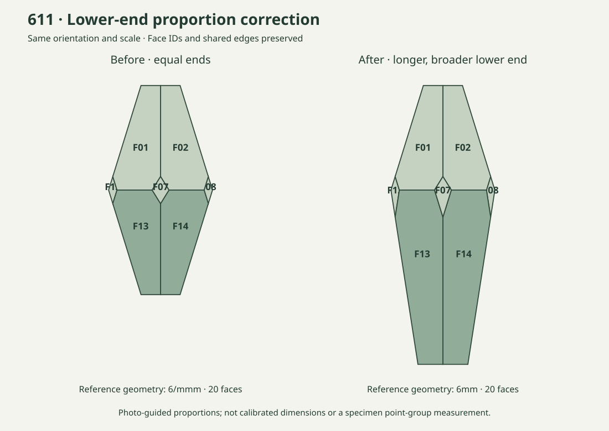

# 611 lower-end correction · 2026-09-22

Version 1.0.1 corrects the six lower faces after the user confirmed that photograph 2 should guide their length and terminal width. The previous input used equal upper and lower pyramid slopes and equal end distances, making the lower end too short and too sharply tapered for the requested reference shape.



## What changed

- Lower faces **F03, F04, F05, F13, F14, F18** retain their photo labels, azimuths and shared-edge neighbors. The photo numbering crosses the two end rings; it is not simply F13–F18.
- Halve the lower axial slope while keeping the equatorial intersection fixed. Cut the lower end at reference distance **3.80**, versus **2.28** previously. Its axial extent increases by **66.7%**; terminal width increases by **27.6%**.
- Upper-end coordinates remain unchanged. There are still **36 vertices, 54 edges and 20 faces**. Other 14 reference models are unchanged.
- Update the six lower reference indices, for example F13 from `(1 0 −1 −1)` to `(2 0 −2 −1)`, with the same reference basis. These are model indices, not measured specimen indices.
- The unequal end geometry has highest geometric point group **6mm / L⁶ 6P**, with 12 operations and six vertical mirrors. It no longer has a horizontal mirror or inversion. Reports now distinguish this from the prior symmetric `6/mmm` approximation.

The ratios are a photo-guided reference reconstruction, not calibrated physical dimensions. Changing the model's geometric group does not establish or revise a measured mineral/specimen point group.

## Validation and reproduction

The new regression failed on the old equal-ended model before the input correction. It now checks lower-end height, terminal width, all face labels, the six bottom-cap neighbors, closure and geometric symmetry.

```bash
python3 -m unittest discover -s tests -p test_611.py -v
python3 scripts/build_reference_gallery.py
python3 scripts/audit_reference_groups.py
python3 scripts/render_611_comparison.py
```

`docs/611-before.json` preserves the prior public reference input for the comparison. `examples/reference-atlas.json` is the current source for the generated offline atlas. Software/plugin **1.0.1** and standalone skill **2.0.1** carry the same corrected input.

The local photographic atlas also refreshes the two saved 611 camera fits. Their corner RMSE is **31.1 px** (photo 1) and **31.4 px** (photo 3) in the legacy 1368×1824 inspection frame; the prior values were 22.5 and 23.7 px. These residuals increased, so this release does **not** claim a better multi-photo fit or measurement accuracy. Photo 2 remains an original-photo reference without a claimed calibrated overlay. No 611 photograph is added to the public repository or release.

## 中文更新说明

本次按用户确认，以照片2为依据修正611下方六个面的长度和底部收口。旧模型把上下两端设为相同斜率、相同面距；现将下端加长、底部加宽。

修正面为 **F03、F04、F05、F13、F14、F18**，不是按连续面号13～18替换。面号、朝向、共棱关系及上端坐标保留；下端高度增加约 **67%**、底宽增加约 **28%**。其他14组不变，总数仍为15组、226面。

参考指数、三维数据、五项报告和离线包同步更新。由于上下端不再等价，当前参考外形的几何点群为 **6mm**，不再沿用旧模型的 **6/mmm**；这不是对实物点群的测定。照片和尺寸仍有近似性，旧照片1、3重新配准后的残差约31像素，未宣称多照片拟合精度提升。

旧版本保留。软件/插件包升级为 **1.0.1**，独立技能包升级为 **2.0.1**；公开包不附611私人照片。
