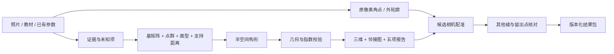

# 工作流与算法

同一套核心由CLI、本机HTTP界面、stdio MCP调用。人工/视觉观察只进入候选参数和证据字段，不绕过数学检查，也不自动成为实物标定。

|环节|原流程的主要限制|本次处理|
|---|---|---|
|输入|模型和微信路径写在脚本里|版本化JSON、相对资源、可移植案例，原始输入随结果保存|
|定轴|不同文件分别处理三轴/四轴|统一A、右手/度量检查、h+k+i=0及反算法线|
|晶形|群展开易误用坐标置换|32类参考群生成闭包，变换法线后回到同一度量的指数|
|构形|每个交点反复执行通用矩阵求解和线性去重|三向量解析交点、早期半空间剔除、空间桶去重|
|失败检测|有限交点可能掩盖未闭合方向|先检查衰退方向；拒绝重复面、被完全截去的指定面和面数冲突|
|配准|大量随机初值，轮廓在目标函数中重复采样|确定性几何初值、粗到细筛选、缓存观测轮廓/采样、可选稳健损失|
|证据|单面残差容易被当成整体正确|竞争解、正反面、原始像素误差、独立留出点分开；不自动镜像|
|渲染|多处手写面号，旋转曾随轮廓改变比例|复用原固定视框渲染、同一数据驱动模型与报告，完整226面回归|
|复现|输出覆写、依赖开发者环境|内容寻址目录、代码/输入指纹、完整性检查、损坏缓存保留、锁定可选依赖|
|分享|只有零散HTML/提示词|离线软件、CLI、MCP、插件manifest、独立skill与案例/测试|

## 数学约定

独立直接基A的列为a、b、c（四轴时a₁、a₂、c）。晶面单位外法线为normalize(A⁻ᵀh)，其中四轴先去掉冗余i。面距d是单位法线的支持距离。所有面取n̂·r≤d的交集，原点必须在内部。

三面交点通过Cramer叉积公式计算，平行/近共面三元组跳过。再检查全部半空间，并以与整体尺度关联的容差去重；面内角排序采用外法线确定的有向基，邻接从共同的真实边生成。最后检查体积、绕序、Euler和声明点群。显式输入的面若完全不露出，返回错误而非悄悄少画一面。

点群操作在规范正交视框中生成，再映射到模型坐标；操作集合与晶体学设置在skill参考文档中明确。声明群与模型相容不等于已求出实物的最高群，不能据形态替代晶体结构证据。

## 相机

默认距离D=8r，r是模型顶点最大半径；拟合旋转R、统一比例s和二维偏移t。投影为(x,y)=s(qx,−qy)/(1−qz/D)+t，q=Rv。距离无校准时保持明确假设，不无约束地连同晶胞轴比一起“精确求解”。

每个角点循环对应先用面内几何/图像方向初始化，短程粗拟合后精化最佳三个。观测轮廓和采样提前计算。目标包括角点、双向轮廓距离和低权重面中心；正反面也检查。与旧目标的部分权重及可见性处理不同，性能对照不能声称是完全相同目标函数。

输出原始像素RMSE、归一误差、竞争解与留出点误差。留出点若同时参与拟合直接拒绝。多解、镜像、编号冲突或无独立点时保留限制，不自动填充“已证实”。

## 缓存与记录

规范化参数与程序指纹确定运行ID。缓存命中之前检查所有产物（包括zip）的SHA-256；损坏结果保留，新建修订目录。zip固定时间戳，数学输入相同、环境相同可重建同内容。收据记录Python/平台；跨浮点库末位差异仍可能出现。

运行期间代码变化会要求重启，防止“内存中旧算法+磁盘上新版本指纹”混用。输入源与已有结果不覆盖；临时构建成功后才移入正式目录。

## 依据

- [IUCr四指数](https://journals.iucr.org/j/issues/2018/04/00/gj5205/index.html)
- [SciPy least_squares](https://docs.scipy.org/doc/scipy/reference/generated/scipy.optimize.least_squares.html)
- [MCP stdio 2025-06-18工具协议](https://modelcontextprotocol.io/specification/2025-06-18/server/tools)
- [OpenAI插件打包](https://developers.openai.com/plugins/build/plugins)
- [Agent Plugins MCP schema](https://agent-plugins.org/schemas/1.0.0/mcp.schema.json)

这些链接供进一步查阅；离线核心执行不需要联网读取文档。
