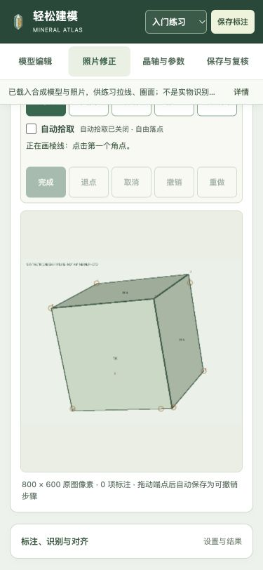

# 四个工作区 / Four workspaces

[简体中文](#中文) · [English](#english)

本页对应 `main` 源码中的软件 **v1.1.0-dev.4** 和技能 **v2.1.0-dev.4**；最新正式标签及其下载包仍为 **v1.0.1**。本轮调整布局与操作入口，建模和照片识别算法、14个公共 MCP 工具保持不变。

## 按当前任务切换

|工作区|主要操作|
|---|---|
|模型编辑|新建／导入项目，选面、推拉、缩放及观察固定视图|
|照片修正|载入照片，画线、修面、预览候选和对齐当前模型|
|晶轴与参数|定义参考轴，查看几何量和条件指数|
|保存与复核|保存模型或标注、导出离线结果、查看已保存文件及交换复核包|

页内切换保留已载入的模型、照片标注、操作历史和正在画的未完成点。它不会自动完成或保存一条线，也不会把候选面变成确认结果。回到照片工作区后，可以继续绘制。

导航按钮取得焦点后，可按 **← / →** 切换相邻工作区，**Home / End** 跳到第一个／最后一个。浏览器返回、前进和旧链接（如 `#photoEditor`、`#axesSection`、`#saveArea`）仍可进入对应工作区。

## 照片画布与检查面板

照片工作区将大画布放在主要位置。上方紧凑工具条保留画线、圈面、修正、识别面，以及完成、退点、取消和撤销操作。模型面关联、识别结果、对齐和高级拾取选项集中在右侧检查面板。

窄屏时，检查面板移到画布下方并可折叠；点击“标注、识别与对齐”展开。聚焦物体、放大和布局切换只改变查看方式，标注仍按原图显示坐标保存。

画线与拾取方法见[入门指南](beginner-ux-guide.md#中文)，实物照片修面及紫色线框对齐见[照片纠错指南](photo-correction-guide.md#中文)。

## 保存什么，去哪里找

顶部保存按钮会随工作区改变：在“照片修正”中保存标注，其他工作区保存模型。照片中还有未完成的线或区域时，会提示先完成或取消，不把临时点悄悄省略后保存。

保存成功后，在“保存与复核”查看本地路径和文件链接；较宽屏幕也可点击顶部“已保存文件”进入该区。模型项目和照片纠错分别保存，需要一起保留时分别执行对应操作。工作区切换不是文件保存；刷新或关闭页面前，应先保存需要继续使用的结果。

## 点选参考轴

在“晶轴与参数”中选择“点选两个顶点”或“点选参考原点”，界面会转到模型工作区。点击紫色顶点后返回参数区，核对已填入的方向或原点，再点击“定义轴 · 保持外形”应用。点选只是填写参考值；默认重新定义轴不会改变实体外形。

本轮没有改变识别算法。自动候选、参考指数和相机拟合误差仍按原有证据边界解释。

## Choose a workspace

This guide covers software **1.1.0-dev.4** and skill **2.1.0-dev.4** on `main`. The latest tagged release and its archives remain **v1.0.1**. Modeling and photograph-recognition algorithms and the **14 public MCP tools** are unchanged.

|Workspace|Main tasks|
|---|---|
|模型编辑 — Model editing|Create/import projects, select and move faces, scale the model and inspect fixed views|
|照片修正 — Photo correction|Draw and edit annotations, inspect region proposals and align the current model|
|晶轴与参数 — Axes and parameters|Define reference axes and inspect geometry and conditional indices|
|保存与复核 — Save and review|Save projects or annotations, export offline results, find saved files and exchange review packets|

Switching within the page preserves loaded models, annotations, editing histories and unfinished drawing points. It does not finish or save a drawing automatically. Return to the photograph workspace to continue.

With a navigation tab focused, use **Left / Right** to switch adjacent workspaces and **Home / End** for the first or last. Browser Back/Forward and older anchors such as `#photoEditor`, `#axesSection` and `#saveArea` still open the relevant workspace.

## Keep the canvas in view

The photograph workspace gives the canvas the main area. A compact toolbar holds drawing, correction, face proposals, completion and undo controls. Feature assignments, recognition results, alignment and advanced picking settings sit in the right inspector. On narrow screens, the inspector moves below the canvas and can be expanded through **标注、识别与对齐**.

Object focus, zoom and layout changes affect viewing only; saved annotations retain original displayed-image coordinates. See the [beginner guide](beginner-ux-guide.md#english) for picking and the [photo correction guide](photo-correction-guide.md#english) for region editing and alignment.

## Save and return to the result

The header button saves annotations in the photograph workspace and the model elsewhere. Unfinished photograph lines or regions block annotation saving until completed or cancelled, so temporary points are not silently omitted.

Saved paths and file links appear in **保存与复核**. On wider screens, **已保存文件** in the header also opens that workspace. Model and annotation files are separate; save each when both are needed. Workspace navigation is not file persistence, so save the required results before reloading or closing the page.

## Pick reference-axis directions

Start point picking in the axes workspace. The interface opens the model workspace for selecting purple vertices, then returns to the parameter panel. Check the filled direction or origin and explicitly apply **定义轴 · 保持外形**. Picking only fills reference values; redefining the reference axes preserves the solid's shape.

This layout iteration does not change recognition algorithms or the interpretation limits of candidates, reference indices and fitting residuals.
