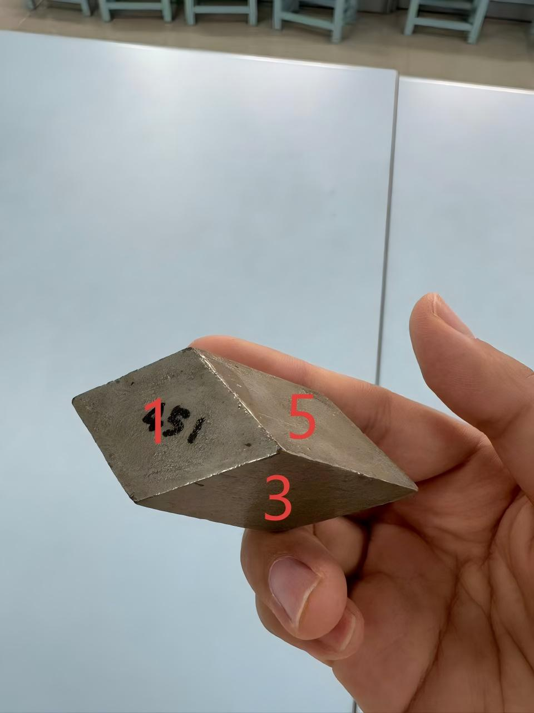
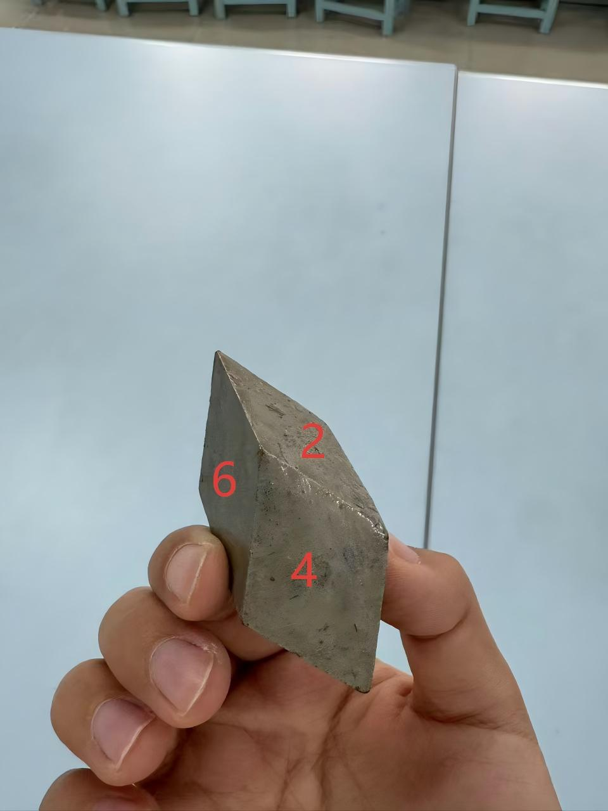

# 451 Photo Study / 451 原图示例

[English](#english) · [简体中文](#中文)

<a id="english"></a>

## English

This public example connects **three source photographs** of the 451 teaching model to its six-face reference geometry. QiushanHuang explicitly authorized publication of this one photo set. No other previously private photo set is included.

| Photo 01 | Photo 02 | Photo 03 |
|---|---|---|
|  |  |  |


### Contents

- `photos/01.jpg`–`03.jpg`: unchanged source JPEGs, each960×1280. The inspected files contain no EXIF fields. Original hashes are listed in`manifest.json`.
- `project.json`: trigonal, six faces, reference point group−3m; basis, support distances, and evidence included.
- `annotations/01.json`, `02.json`: manually identified face corners, silhouettes and low-weight face-center constraints in original pixels.
- `fits/01.json`, `02.json`: saved camera parameters, fit errors, competing solutions, environment and source fingerprints.
- `model.json`, `quality.json`: the exact reference geometry and mathematical checks used by the example.
- `model-preview.svg`: a computed geometric plot, not an AI reconstruction or an edited photograph.

If you downloaded the standalone photo-example ZIP, open its included`index.html` directly. The commands below apply to a cloned software repository.

### Reproduce From The Repository Root

Replay the saved fits and export an interactive, offline comparison using standard-library Python:

```bash
python3 scripts/build_photo_example.py --out atlas-runs/451-photo-study
```

Open`atlas-runs/451-photo-study/index.html`. Select **照片视角** and **线框叠加** to compare the model with a fitted photograph. Use the photograph dropdown for all three views, enter`F01` to locate a face, or select a four-index symbol from the face table. Photo03 has no fitted overlay.

To recompute the two camera fits with the pinned NumPy/SciPy environment:

```bash
.venv/bin/python scripts/build_photo_example.py --refit --out atlas-runs/451-photo-study-refit
```

`--refit` explicitly refreshes this example's tracked saved fit/model/preview files. Inspect the diff before committing updated reference data. It never changes the source photographs. For a separate single-photo experiment that leaves the example files alone:

```bash
.venv/bin/python atlas_cli.py fit examples/451-photo-study/project.json examples/451-photo-study/annotations/01.json --image examples/451-photo-study/photos/01.jpg --out atlas-runs
```

The browser workbench can also import`project.json`, the corresponding photograph, and its annotation JSON directly.

### What This Demonstrates—and What It Does Not

The example demonstrates face/index lookup, a consistent reference basis, real shared-edge adjacency, photo-pose fitting, overlays and a five-field report. The fitted corners and silhouettes are training observations, not independent validation points.

The c/a ratio and index assignments belong to a reference model, not a measured natural-mineral cell. Opposite-face numbering F04/F06 retains its earlier provisional status. Photo03 is additional visual evidence only; no independent error metric has been established for it. See`manifest.json` and[DATA_NOTICE.md](DATA_NOTICE.md) for provenance and photo-rights boundaries.

<a id="中文"></a>

## 中文

本例公开451教学模型的**三张原图**，并与六面参考几何对应。QiushanHuang已明确授权公开这一组照片；其他原先未公开的照片组不在本次范围内。

数据包括：原始JPEG、原图像素角点与外轮廓、模型参数、两张照片的相机拟合、逐面指数、几何校验，以及程序计算的模型预览图。三张原图均为960×1280，检查时没有EXIF字段，文件字节与原件一致；没有裁剪、镜像、改色或AI修图。

下载独立原图示例ZIP后，直接打开其中的`index.html`即可离线对照。若已克隆软件仓库，在仓库根目录运行上面的`build_photo_example.py`命令，即可使用保存的配准参数生成离线对照页面；无需安装配准依赖。打开输出的`index.html`，点击“照片视角”和“线框叠加”，再切换照片、输入面号或四指数查看空间对应。第三张只显示原图，不伪造配准。

安装NumPy、SciPy后，加`--refit`可重新拟合；此选项会明确刷新本例保存的拟合、模型和预览文件，应检查差异后再提交。单独试验可用`atlas_cli.py fit`，不会改动本例文件。浏览器工作台也可依次导入本目录中的参数、照片与标注JSON。

本例不是天然矿物晶胞或晶面指数的测定。轴比与面型是参考假设，F04/F06的相反面编号对应仍为暂配；两张拟合图没有独立留出坐标，第三张也未完成定量独立验收。原图面号、内部F编号和晶面指数分别保存，不将它们混为一谈。

[English](#english) · [简体中文](#中文)
